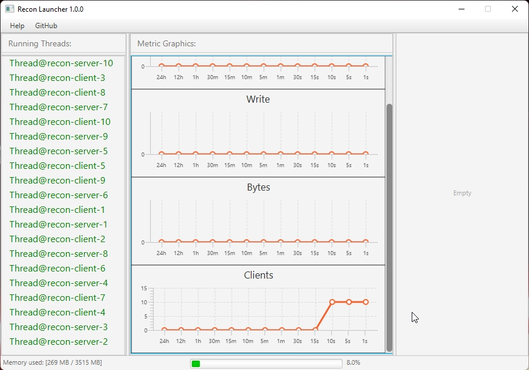

# UI LAUNCHER RECON

 

#### View & Analyze Statistics

   

      The Library in development...   For contact me see "Feedback" 
   

 

---

### Feedback

+ **[Discord Server](https://discord.gg/GmT9pUy8af)**
+ **[VKontakte Page](https://vk.com/itzstonlex)**

---

## What is this?

This application is able to parse the data 
from the [Metrics Module](../metrics-recon) 
and display the current connection flows.

---

**ATTENTION!** This application will be updated 
with functionality in the future. You can also 
contribute to this by **submitting your ideas on 
my discord server**!